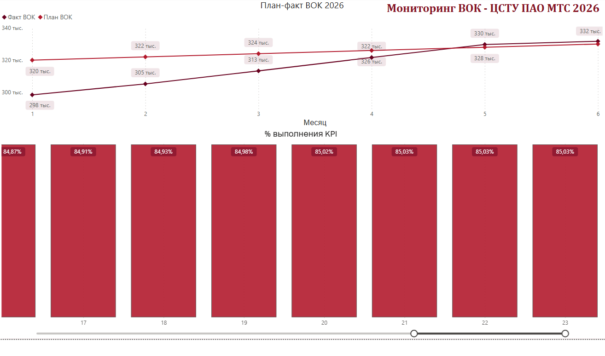
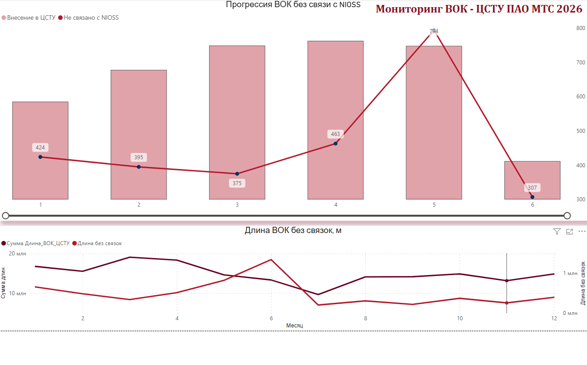
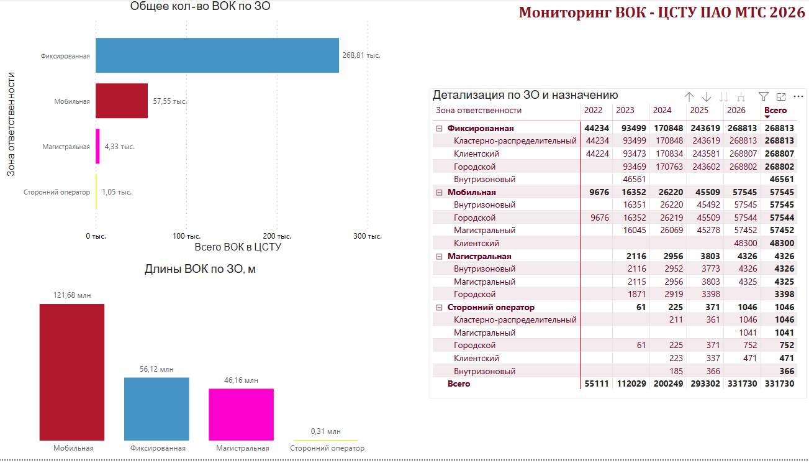

Динамика развития кабельной инфраструктуры МТС

Дашборд в Power BI для мониторинга состояния и прогрессии строительства/модернизации волоконно-оптических кабелей (ВОК) в системе технического учёта ЦСТУ.

О проекте

Проект создан как демонстрация end-to-end BI-аналитики на реальной производственной задаче из телеком-отрасли.

Задача: отслеживать прогрессию разварки ВОК, выявлять некачественные связки с NIOSS и контролировать выполнение плана по зонам ответственности.

Стек: Power BI Desktop · DAX · Power Query

Структура дашборда

Страница 1 - Разварка и KPI

- «План-факт ВОК 2026» - линейный график с двумя рядами (Факт ВОК / План ВОК) по месяцам. Показывает динамику фактического прироста кабелей относительно планового значения.
- «% выполнения KPI» - 100% stacked bar chart с прогрессией разварки по неделям. Позволяет отслеживать долю корректно разваренных ВОК на каждой отчётной неделе.
Страница 2 - Связки с NIOSS

- «Прогрессия ВОК без связи с NIOSS» - комбо-chart (bar + line): столбцы показывают количество ВОК, внесённых в ЦСТУ но не связанных с NIOSS; линия - динамику по месяцам.
- «Длина ВОК без связок, м» - двойной линейный график с двумя осями: суммарная длина ВОК в ЦСТУ (левая ось) и длина без связок (правая ось) по месяцам.

Страница 3 - Зоны ответственности

- «Общее кол-во ВОК по ЗО» - горизонтальный bar chart с разбивкой по зонам ответственности (Фиксированная, Мобильная, Магистральная, Сторонний оператор). Ось X - количество ВОК в ЦСТУ.
- «Длины ВОК по ЗО, м» - вертикальный столбчатый график с суммарным метражом кабелей по каждой зоне ответственности.
- «Детализация по ЗО и назначению» - сводная матрица с иерархией: Зона ответственности → тип назначения (Кластерно-распределительный, Клиентский, Городской, Внутризоновый, Магистральный) в разрезе лет (2022–2026) с итоговым столбцом «Всего».

Ключевые меры DAX

dax
-- Накопительный итог по неделям
Кол-во ВОК (Накопительно по неделям) =
CALCULATE(
[Кол-во ВОК],
    FILTER(
        ALL(CSTU_VOK[Неделя]),
        CSTU_VOK[Неделя] <= MAX(CSTU_VOK[Неделя])
    )
)
-- Прогрессия разварки
Прогрессия разварено =
DIVIDE(
    [Разварили корректно],
    [Кол-во ВОК (Накопительно по неделям)],
    0
)
-- % связок с NIOSS
% связок =
DIVIDE(
    COUNTROWS(FILTER(CSTU_VOK, NOT ISBLANK(CSTU_VOK[id_nioss]))),
    [Всего ВОК в ЦСТУ],
    0
)

Контекст

Отчёт основан на структуре данных из централизованной системы технического учёта кабельной инфраструктуры. Данные обезличены и агрегированы. 
Проект отражает реальный подход к операционной аналитике в телеком-отрасли: от сырых данных о монтаже до визуализации прогрессии KPI.

Автор
Егор Салаев - BI-аналитик / Data Analyst  
[hh.ru](https://hh.ru) · 
salaevei1999@gmail.com
@georgosing
